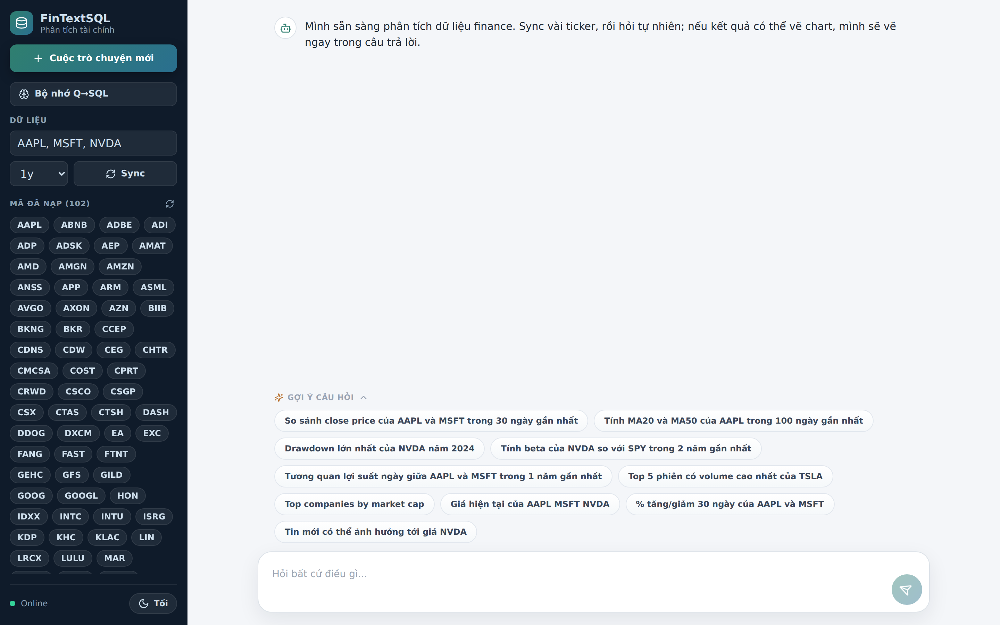
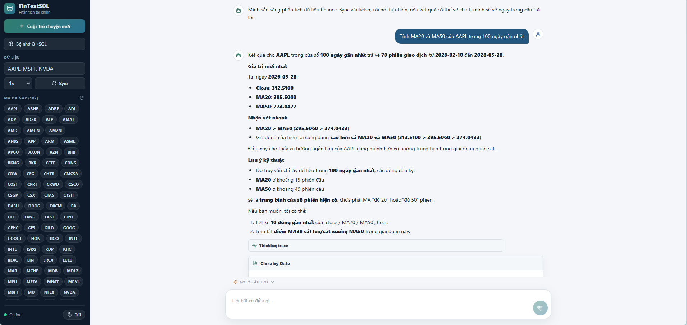
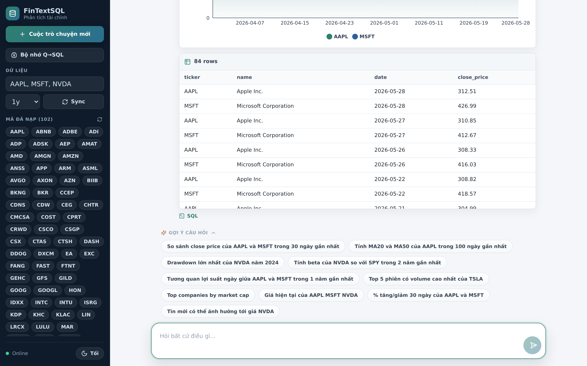
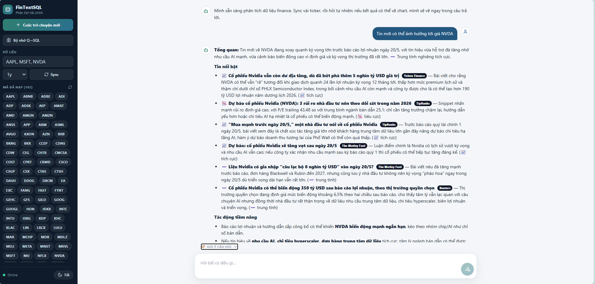
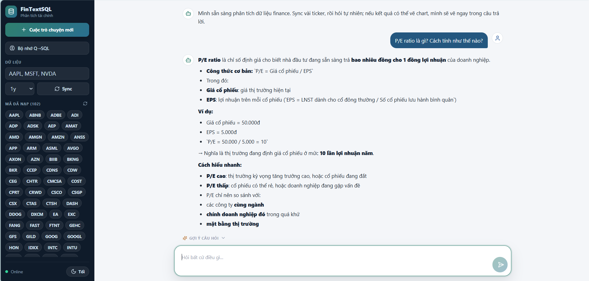
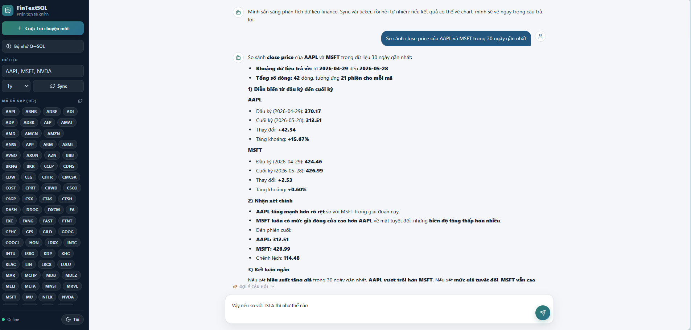
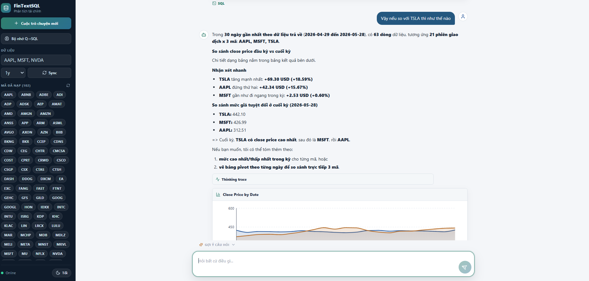
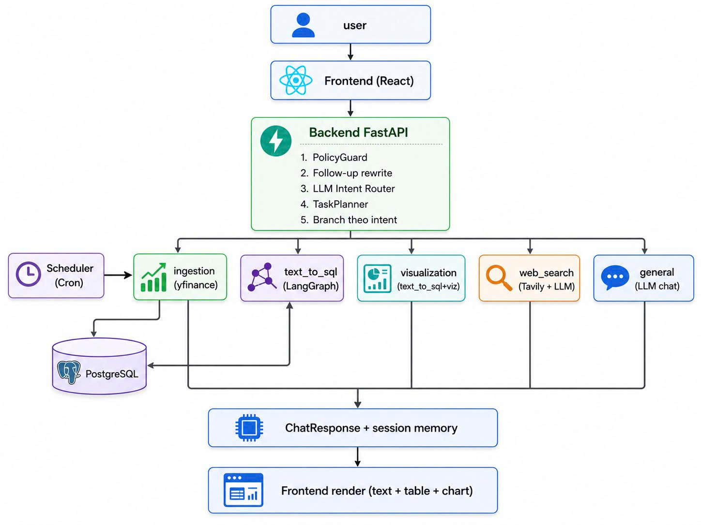
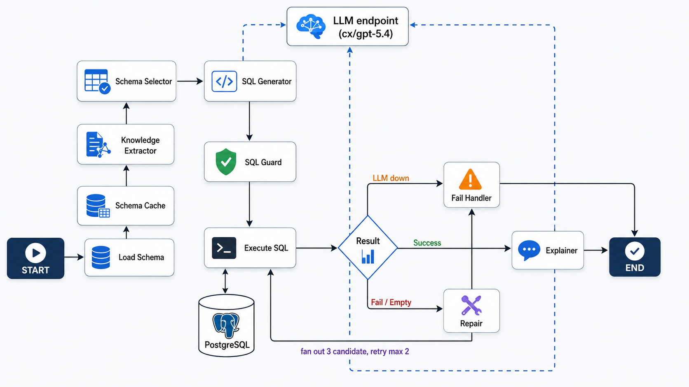

# FinTextSQL — Trợ lý Phân tích Dữ liệu Tài chính bằng Ngôn ngữ Tự nhiên

> Hệ thống hỏi đáp dữ liệu chứng khoán bằng tiếng Việt/Anh tự nhiên — sinh SQL an toàn,
> tra cứu tin tức + thông tin công ty qua web search, vẽ biểu đồ tự động và streaming
> response theo phong cách ChatGPT.



---

## Mục lục

1. [Giới thiệu](#1-giới-thiệu)
2. [Demo các tính năng chính](#2-demo-các-tính-năng-chính)
3. [Kiến trúc hệ thống](#3-kiến-trúc-hệ-thống)
4. [Pipeline Text-to-SQL](#4-pipeline-text-to-sql)
5. [Tính năng nổi bật](#5-tính-năng-nổi-bật)
6. [Công nghệ sử dụng](#6-công-nghệ-sử-dụng)
7. [Cài đặt và chạy thử](#7-cài-đặt-và-chạy-thử)
8. [Cấu trúc dự án](#8-cấu-trúc-dự-án)
9. [Hạn chế và hướng phát triển](#9-hạn-chế-và-hướng-phát-triển)
10. [Tham khảo](#10-tham-khảo)

---

## 1. Giới thiệu

### Vấn đề thực tế

Dữ liệu chứng khoán (giá, khối lượng, fundamentals, tin tức) là nguồn thông tin quan trọng cho nhà đầu tư cá nhân, sinh viên ngành tài chính và nhà phân tích dữ liệu. Tuy nhiên có 4 rào cản chính:

- **Người không biết SQL** không tự truy vấn được, phải chờ dev hoặc dùng dashboard cố định.
- **Dashboard cố định** chỉ trả lời câu hỏi đã pre-define; câu hỏi mới = đợi build chart mới.
- **LLM tổng quát** (ChatGPT, Gemini) trả lời sai dữ liệu cụ thể vì không có kết nối DB real-time.
- **Câu hỏi tài chính đa dạng** — có dạng truy vấn DB, dạng tra fact (CEO, trụ sở), dạng tin tức, dạng biểu đồ — mỗi loại cần pipeline khác.

### Giải pháp đề xuất

FinTextSQL là một hệ thống **Multi-path Agent** kết hợp 3 kỹ thuật cốt lõi:

1. **LLM-first Intent Router** — gọi LLM phân loại câu hỏi vào 1 trong 5 luồng xử lý, fallback rule-based khi LLM down.
2. **LangGraph Text-to-SQL Pipeline** — orchestrate sinh SQL → guard → execute → repair → explain theo state machine, có cross-session memory.
3. **Tavily Web Search Integration** — tra cứu tin tức và fact ngoài database (CEO, founder, headquarters) bằng web search engine chuyên cho AI.

Output: trả lời **tiếng Việt tự nhiên** kèm **bảng dữ liệu**, **biểu đồ tự động** (line/bar/scatter), và **SSE streaming** để user thấy response chạy như ChatGPT.

### Đối tượng người dùng

- Nhà đầu tư cá nhân muốn phân tích nhanh mà không biết SQL.
- Sinh viên ngành tài chính học cách khai thác dữ liệu thực.
- Nhà phân tích/dev muốn prototype công cụ chat tài chính nội bộ.

---

## 2. Demo các tính năng chính

### 2.1 Giao diện trang chủ

Giao diện chat phong cách ChatGPT với:

- **Sidebar trái**: list 102 mã NASDAQ-100 đã ingest, nút sync, bộ nhớ Q→SQL, đổi theme sáng/tối.
- **Khu vực chat trung tâm**: hiển thị greeting, gợi ý câu hỏi mẫu.
- **Composer dưới**: ô nhập "Hỏi bất cứ điều gì..." kèm gợi ý câu hỏi mở rộng.


### 2.2 Text-to-SQL — Sinh SQL và trả về bảng dữ liệu

Khi user hỏi câu cần truy vấn database, intent router phân loại vào `text_to_sql` và pipeline LangGraph chạy:

- **Nhận câu hỏi**
- **Intent Router** phân loại
- **Load Schema** đọc cấu trúc DB
- **Schema Cache** (`@lru_cache`)
- **Knowledge Extractor** tách ticker + glossary
- **Schema Selector** lọc bảng liên quan

Hệ thống hiển thị **Thinking Trace** trực quan để user theo dõi từng bước:



Câu hỏi mẫu: *"Giá đóng cửa cao nhất của AAPL trong năm 2024 là bao nhiêu?"*

### 2.3 Visualization — Vẽ biểu đồ tự động

Path `visualization` gọi `text_to_sql` nội bộ để lấy dữ liệu, sau đó **tự suy ra** `VisualizationSpec` (line / bar / area / scatter) dựa trên schema kết quả.

Output: chart Recharts kèm bảng dữ liệu + nút xem SQL gốc.



Câu hỏi mẫu: *"Vẽ chart giá đóng cửa của AAPL và MSFT trong 60 ngày qua"*

### 2.4 Web Search — Tra cứu tin tức và fact ngoài DB

Path `web_search` xử lý câu hỏi cần thông tin **ngoài database** (CEO, founder, tin tức, website công ty). Pipeline:

- **Intent Router** phát hiện keyword "CEO / tin tức / ai là..."
- **Tavily Search** query web với context current year + ticker name
- **LLM Summarize** tóm tắt tiếng Việt từ snippet, cite nguồn URL
- **Response** trả về answer + sources table



Câu hỏi mẫu: *"CEO của Apple hiện tại là ai?"*

Bảng kết quả hiển thị các nguồn web với title, URL và snippet để user verify:



### 2.5 Multi-turn Follow-up — Hỗ trợ hội thoại đa lượt

Hệ thống ghi nhớ ngữ cảnh trong cùng session để xử lý câu hỏi follow-up như *"còn TSLA thì sao"*, *"cùng khoảng thời gian đó"*, *"2 năm này"*…

**Ví dụ luồng 2 câu hỏi**:

**Câu 1**: *"So sánh close price của AAPL và MSFT trong 30 ngày gần nhất"*

Hệ thống trả về phân tích chi tiết:
- Diễn biến từng mã từ đầu kỳ đến cuối kỳ
- Mức tăng tuyệt đối + tăng %
- Nhận xét chính (AAPL tăng mạnh hơn, MSFT đi ngang…)
- Kết luận ngắn



**Câu 2 (follow-up)**: *"Vậy nếu so với TSLA thì như thế nào"*

Hệ thống tự động:
- Lấy lại context "30 ngày gần nhất, close price"
- Thêm TSLA vào danh sách so sánh (giờ là 3 mã)
- Sinh lại SQL với điều kiện mới
- Vẽ chart `Close Price by Date` với 3 đường (AAPL, MSFT, TSLA)
- Tóm tắt nhận xét + ranking



→ User không cần lặp lại "30 ngày qua" hay "close price" — hệ thống hiểu từ ngữ cảnh.

---

## 3. Kiến trúc hệ thống



### Luồng request từ user → response

1. **User** gõ câu hỏi tiếng Việt/Anh trên giao diện chat.
2. **Frontend (React)** gửi `POST /chat` hoặc `POST /chat/stream` qua HTTP/SSE.
3. **Backend FastAPI** xử lý qua 5 bước tuần tự:
   1. **PolicyGuard** — chặn câu out-of-scope (DDL, secrets, investment advice).
   2. **Follow-up rewrite** — viết lại câu cho self-contained nếu là follow-up multi-turn.
   3. **LLM Intent Router** — phân loại 5 intent (text_to_sql / visualization / web_search / ingestion / general).
   4. **TaskPlanner** — sinh 1-N task tương ứng với intent.
   5. **Branch theo intent** — dispatch task tới path service phù hợp.
4. **5 path services** xử lý độc lập:
   - **`text_to_sql`** — LangGraph pipeline, đọc/ghi PostgreSQL.
   - **`visualization`** — gọi `text_to_sql` nội bộ + chart inferencer.
   - **`web_search`** — Tavily Search API + LLM tóm tắt.
   - **`ingestion`** — yfinance + upsert PostgreSQL.
   - **`general`** — LLM conversational với persona FinTextSQL.
5. **ChatResponse + session memory** — assemble response object trong RAM (không đọc từ PG trực tiếp).
6. **Frontend render** — text + table + chart (Recharts).

### Sidecar — Scheduler

Container `scheduler` chạy **cron mỗi 10 phút** trong giờ NASDAQ (13:30-22:00 UTC, T2-T6), gọi `POST /ingest` để tự cập nhật bar daily đang chạy cho 100 mã NASDAQ-100.

### External services (ngoài Docker Compose)

- **LLM endpoint** — OpenAI-compatible API qua `httpx`, model `cx/gpt-5.4`.
- **yfinance** — Python library import, lấy prices + fundamentals từ Yahoo Finance.
- **Tavily Search API** — REST API qua `httpx`, search engine chuyên cho AI agent.

### Docker Compose Stack (5 service)

| Service | Mô tả | Port |
|---|---|---|
| `postgres` | PostgreSQL 16-alpine | 5432 (internal) |
| `backend` | FastAPI + Uvicorn | 18000 (expose) |
| `scheduler` | Python long-lived worker | no port |
| `frontend` | Nginx + Vite build | 15173 (expose) |
| `cloudflared` | Cloudflare Tunnel | public HTTPS URL |

---

## 4. Pipeline Text-to-SQL



Text2SQL là path phức tạp nhất, được điều phối bằng **LangGraph StateGraph**. Toàn bộ logic chạy qua các node sau:

### 4.1 Build SQL phase (4 node)

| Node | Có gọi LLM? | Vai trò |
|---|---|---|
| **Load Schema** | ❌ | Đọc schema text 6 bảng từ `schema.py` |
| **Schema Cache** | ❌ | Decorator `@lru_cache` cache theo question hash |
| **Knowledge Extractor** | ❌ | Regex tách tickers, time_window + dict glossary (MA20, drawdown, beta…) |
| **Schema Selector** | ❌ | Keyword matching lọc bảng liên quan (giảm token vào LLM) |

→ Tất cả đều **rule-based**, không gọi LLM. Chạy trong vòng vài ms.

### 4.2 SQL Generation + Execution

| Node | Có gọi LLM? | Vai trò |
|---|---|---|
| **SQL Generator** | ✅ **LLM call #1** | Sinh 1 candidate SQL từ schema + knowledge + few-shot, max 600 tokens, temperature 0.2 |
| **SQL Guard** | ❌ | Parse AST bằng `sqlglot`, chặn DDL/DML, whitelist 5 bảng, ép `LIMIT 5000` nếu thiếu |
| **Execute SQL** | ❌ | Chạy SQL qua SQLAlchemy + psycopg, đọc/ghi PostgreSQL hai chiều |

### 4.3 Conditional Routing (Result diamond)

Sau khi execute, `result_after_execute` rẽ 4 nhánh dựa trên trạng thái:

| Điều kiện | Đi đến |
|---|---|
| `success: rows > 0` | → Explainer |
| `fail SQL error, attempt < 2` | → Repair Agent |
| `empty 0 rows, attempt < 1` | → Repair Agent |
| `LLM unavailable / attempt ≥ 99` | → Fail Handler |

### 4.4 Terminal Nodes

| Node | Có gọi LLM? | Vai trò |
|---|---|---|
| **Repair Agent** | ✅ **LLM call #2** | Khi candidate đầu fail, sinh **3 candidate đa dạng** (window function / CTE / aggregation), retry tối đa 2 lần |
| **Explainer** | ⚠️ **LLM stream** (đôi khi) | Ưu tiên 12+ deterministic VN formatter (instant); fallback LLM stream khi pattern không match |
| **Fail Handler** | ❌ | Trả message tiếng Việt cụ thể (LLM unavailable / exhausted / generic), không leak stack trace |

### 4.5 Repair Loop

- `Repair Agent → Execute SQL` (retry tối đa 2 lần, "fan out 3 candidate")
- `Repair Agent → Fail Handler` (khi chính repair gặp LLMError)

### 4.6 LLM Call Budget

| Scenario | Số LLM call |
|---|---|
| **Best case** | 2 calls — Intent Router (Backend) + SQL Generator |
| **Common case** | 3 calls — Intent Router + SQL Generator + Explainer stream |
| **Worst case** | 5 calls — Intent Router + SQL Generator + Repair (×2) + Explainer stream |

### 4.7 Có bao nhiêu agent trong hệ thống?

**Theo định nghĩa chặt** (true agent có feedback loop, tự ra quyết định, có thể retry):

→ **Chỉ 1 agent duy nhất**: `Repair Agent`

Vì nó là component duy nhất có:
- Nhận feedback (SQL error / empty result)
- Tự quyết định cách sửa SQL
- Có thể loop ngược về Execute SQL retry (max 2 lần)

**Theo định nghĩa lỏng** (mọi component gọi LLM): 6 component LLM-powered (Intent Router + SQL Generator + Repair Agent + Explainer + WebSearch summarizer + General chat).

Đây là **LLM-powered pipeline với 1 true agent**, không phải multi-agent system.

---

## 5. Tính năng nổi bật

| # | Tính năng | Mô tả |
|---|---|---|
| 1 | **Hỏi đáp dữ liệu chứng khoán** | Truy vấn giá, volume, market cap, P/E, beta, return, drawdown… của 101 mã NASDAQ-100 |
| 2 | **5 intent path tự động phân loại** | LLM router phân câu hỏi vào: text_to_sql, visualization, web_search, ingestion, general |
| 3 | **Vẽ biểu đồ tự động** | Line/bar/scatter dựa trên schema kết quả, hỗ trợ multi-ticker comparison |
| 4 | **Web search cho fact ngoài DB** | Tavily search + LLM tóm tắt tiếng Việt cho CEO, founder, tin tức, headquarters |
| 5 | **General LLM chat** | Trả lời câu hỏi kiến thức tài chính phổ thông (P/E là gì, Warren Buffett là ai) |
| 6 | **Multi-turn follow-up** | Hỗ trợ "còn TSLA thì sao", "cùng khoảng thời gian đó", "2 năm này" |
| 7 | **Cross-session memory** | Học từ Q→SQL đã thành công qua feature-hash embedding 256-d, retrieve few-shot top-3 |
| 8 | **SSE streaming response** | Text trả lời chạy word-by-word như ChatGPT, không phải đợi full payload |
| 9 | **Auto-refresh near real-time** | Scheduler container cron 10 phút trong giờ NASDAQ, gọi /ingest tự cập nhật |
| 10 | **Cloudflare Tunnel public demo** | Có thể expose hệ thống ra public URL HTTPS không cần SSL setup |
| 11 | **SQL Guard chống injection** | sqlglot parse AST, whitelist 5 bảng, chặn DDL/DML, auto-LIMIT |
| 12 | **Thinking Trace trực quan** | Hiển thị từng bước pipeline đang chạy (Load Schema → Cache → Knowledge → Selector → Generator…) |
| 13 | **Sidebar tickers + memory inspector** | Quản lý 102 mã đã ingest, xem/xóa các cặp Q→SQL đã học |
| 14 | **Dark/light theme + SQL formatter** | Theme tùy chỉnh, SQL pretty-print bằng `sql-formatter` |
| 15 | **Docker Compose đầy đủ** | 5 service đóng gói: postgres + backend + scheduler + frontend + cloudflared |

---

## 6. Công nghệ sử dụng

### Backend

| Tầng | Công nghệ | Phiên bản | Vai trò |
|---|---|---|---|
| Framework | FastAPI + Uvicorn | 0.115+ | HTTP API, async I/O, SSE streaming |
| Pipeline orchestrator | LangGraph | 0.2+ | StateGraph cho Text-to-SQL repair loop |
| SQL validator | sqlglot | 25+ | Parse AST, validate read-only, ép LIMIT |
| ORM | SQLAlchemy + psycopg | 2.0+ / 3.x | Kết nối Postgres, upsert idempotent |
| HTTP client | httpx | 0.27+ | Gọi LLM endpoint + Tavily + RSS, hỗ trợ SSE |
| Schema validation | Pydantic v2 | 2.x | Request/response model |
| Database | PostgreSQL | 16-alpine | Lưu prices, fundamentals, qa_examples |
| LLM | OpenAI-compatible local endpoint | cx/gpt-5.4 | Sinh SQL + tóm tắt tiếng Việt |
| Web search | Tavily Search API | v1 | Tra cứu fact ngoài schema |
| Data source | yfinance | 0.2+ | Lấy giá, fundamentals |
| Python | 3.11+ | | |

### Frontend

| Tầng | Công nghệ | Phiên bản | Vai trò |
|---|---|---|---|
| Framework | React + TypeScript | 18+ | SPA chat UI |
| Build tool | Vite | 5.x | Bundler nhanh |
| Charting | Recharts | 2.x | Line/bar/scatter chart |
| SQL formatter | sql-formatter (npm) | 15+ | Pretty-print SQL trong chat |
| Icons | lucide-react | latest | Icon set |
| Style | CSS variables | — | Light/dark theme |

### DevOps

| Tầng | Công nghệ | Vai trò |
|---|---|---|
| Container | Docker Compose | Đóng gói 5 service |
| Reverse proxy | Nginx (frontend) | Serve SPA + proxy `/api/*` tới backend |
| Public tunnel | Cloudflare Tunnel (cloudflared) | Expose demo qua public HTTPS URL |
| CI/CD | GitHub Actions (tùy chọn) | Build + test pipeline |

---

## 7. Cài đặt và chạy thử

### 7.1 Yêu cầu

- **Docker** + **Docker Compose** v2+
- **LLM endpoint OpenAI-compatible** (vd `llama.cpp` server listening `:20128`, hoặc OpenAI API key)
- **Tavily API key** — đăng ký miễn phí tại https://app.tavily.com/home (1000 search/tháng free tier)
- **(Tùy chọn)** Cloudflare Tunnel token nếu muốn expose public URL

### 7.2 Quick start (5 bước)

```bash
# 1. Clone repository
git clone <repo-url> fintextsql && cd fintextsql

# 2. Cấu hình environment
cp .env.example .env
# Edit .env:
#   - LLM_API_KEY, LLM_BASE_URL (endpoint LLM)
#   - TAVILY_API_KEY (key Tavily)
#   - CLOUDFLARE_TUNNEL_TOKEN (optional)

# 3. Khởi động stack 5 service
docker compose up -d --build

# 4. Ingest dữ liệu NASDAQ-100 (10 năm history)
# Mất ~10 phút cho 100 mã
python3 -m scripts.ingest_universe \
    --base-url http://localhost:18000 \
    --period 10y \
    --batch-size 5

# 5. Truy cập UI
open http://localhost:15173
```

### 7.3 Câu hỏi mẫu test 5 intent

```
text_to_sql:    Giá đóng cửa cao nhất của AAPL trong năm 2024 là bao nhiêu?
visualization:  Vẽ chart giá đóng cửa của AAPL và MSFT trong 60 ngày qua
web_search:     CEO của Apple hiện tại là ai?
ingestion:      Ingest dữ liệu mới cho NVDA
general:        P/E ratio là gì? Cách tính như thế nào?
multi_turn:     [Câu 1] So sánh AAPL và MSFT 30 ngày qua
                [Câu 2] còn TSLA thì sao
```

### 7.4 API endpoints

| Endpoint | Method | Mô tả |
|---|---|---|
| `/health` | GET | Liveness probe |
| `/chat` | POST | Chat non-streaming (trả full JSON) |
| `/chat/stream` | POST | Chat SSE streaming token-by-token |
| `/chat/route` | POST | Preview intent + tickers, không execute |
| `/ingest` | POST | Manual trigger sync yfinance |
| `/companies` | GET | Danh sách 102 mã đã ingest |
| `/memory` | GET | List qa_examples đã học |
| `/memory/{id}` | DELETE | Xóa 1 example |

---

## 8. Cấu trúc dự án

```
DP/
├── docker-compose.yml            # 5 service: postgres, backend, scheduler, frontend, cloudflared
├── .env / .env.example           # DB URL, LLM key, Tavily key, Cloudflare token
├── backend/Dockerfile            # Image Python 3.11
├── pyproject.toml                # Dependencies: fastapi, langgraph, sqlglot, sqlalchemy
│
├── src/fintextsql/
│   ├── api/
│   │   ├── main.py               # FastAPI app + /chat + /chat/stream + /ingest
│   │   └── schemas.py            # Pydantic models, IntentName Literal
│   │
│   ├── core/
│   │   ├── intent.py             # RuleBasedRouter (fallback)
│   │   ├── llm_router.py         # LLMIntentRouter (default, phân loại 5 intent)
│   │   ├── planner.py            # TaskPlanner + follow-up rewrite
│   │   ├── policy.py             # PolicyGuard (unsafe SQL, prediction)
│   │   ├── tickers.py            # Ticker extraction tiếng Việt/Anh
│   │   └── config.py             # Pydantic Settings (env vars)
│   │
│   ├── text2sql/
│   │   ├── service.py            # LangGraph pipeline (build_sql → execute → explain/repair/fail)
│   │   ├── schema.py             # Schema selector + @lru_cache
│   │   ├── knowledge.py          # Knowledge extractor (glossary, time window)
│   │   ├── sql_guard.py          # sqlglot validator
│   │   └── few_shot.py           # qa_examples + feature-hash retrieval
│   │
│   ├── paths/
│   │   ├── visualization/        # Chart inferencer + Recharts spec
│   │   ├── web_search/           # Tavily + LLM summary
│   │   └── general/              # LLM conversational FinTextSQL persona
│   │
│   ├── ingestion/yfinance_service.py
│   │
│   ├── llm/client.py             # httpx wrapper, chat() + chat_stream() SSE
│   │
│   └── db/
│       ├── models.py             # SQLAlchemy: Company, Price, Fundamental, QAExample
│       └── session.py
│
├── scripts/
│   ├── universe.py               # 100 mã NASDAQ-100
│   ├── ingest_universe.py        # Bulk historical ingest (period=10y)
│   └── scheduler.py              # Long-lived cron worker (10 phút giờ NASDAQ)
│
├── frontend/
│   ├── src/App.tsx               # React chat UI + SSE consumer (1500+ dòng)
│   ├── src/styles.css            # CSS variables, light/dark theme
│   ├── nginx.conf                # Reverse proxy /api/* (timeout 300s)
│   └── vite.config.ts
│
├── docs/
│   ├── picture/
│   │   ├── architecture.jpg     # Sơ đồ kiến trúc tổng quan
│   │   ├── text2sql.jpg          # Sơ đồ Text2SQL pipeline
│   │   ├── 01_home.png           # Screenshot trang chủ
│   │   ├── 02_text_to_sql.png    # Screenshot Text2SQL trace
│   │   ├── 02_web_search.png     # Screenshot Web Search trace
│   │   ├── 02_multi_turn_*.png   # Screenshot multi-turn
│   │   └── 03_visualization.png  # Screenshot chart
│   └── Text2sql_report.docx      # Báo cáo đồ án
│
└── tests/                        # Pytest test cases
    └── test_*.py
```

---

## 9. Hạn chế và hướng phát triển

### 9.1 Hạn chế hiện tại

1. **Phụ thuộc LLM endpoint** — toàn pipeline cần LLM. Khi LLM down, system fail nhanh với message rõ ràng nhưng không trả lời được. Rule-based router là fallback nhưng chỉ phân loại được intent, không sinh được SQL.

2. **Chỉ NASDAQ-100** — universe cố định 101 mã. Để mở rộng cần thay đổi `scripts/universe.py` + re-ingest.

3. **Chỉ daily bar** — không có intraday data. Câu hỏi *"giá AAPL lúc 10h sáng"* không trả lời được.

4. **In-memory session state** — restart backend = mất context multi-turn. Production cần Redis hoặc DB-backed session.

5. **Cross-session memory dùng feature-hash** — đơn giản, không cần model embedding nặng, nhưng có thể bỏ sót case rephrase ngữ nghĩa tương đồng. Production nên dùng sentence-transformer (bge-small, multilingual-e5).

6. **Chưa có auth + rate limit** — endpoint công khai, cần JWT middleware trước khi deploy production.

7. **Frontend monolith** — `App.tsx` 1500+ dòng, cần tách component theo concern (Sidebar, Chat, MessageList, Composer, Memory modal).

8. **Tavily free tier giới hạn 1000 search/tháng** — đủ cho demo, production cần upgrade hoặc cache results.

### 9.2 Hướng phát triển

- **Intraday data** — thêm bảng `prices_intraday` lưu bar 1m/5m/15m
- **Sentence-transformer embedding** — thay feature-hash bằng bge-small / multilingual-e5 cho retrieval ngữ nghĩa
- **Fine-tune local model** — Qwen 7B / Llama 3 8B trên 5k cặp (Q, SQL) → chạy 100% local, không phụ thuộc OpenAI-compat endpoint
- **Multi-database support** — HOSE, HNX, UPCOM cho thị trường Việt Nam
- **Forecasting path** — Prophet/ARIMA cho dự báo giá ngắn hạn (có disclaimer rõ ràng)
- **JWT auth + Redis session + caching layer** — production hardening
- **Performance tester (k6)** — load test + soak test trước go-live
- **Monitoring** — Prometheus + Grafana cho metrics, Sentry cho error tracking
- **Export CSV/Excel/PDF** — bảng kết quả có thể export, share permalink

---

## 10. Tham khảo

### Papers & Benchmarks

- Yu, T. et al. (2018). *Spider: A Large-Scale Human-Labeled Dataset for Text-to-SQL.* EMNLP.
- Li, J. et al. (2023). *Can LLM Already Serve as A Database Interface? BIRD Benchmark.* NeurIPS.
- Pourreza, M. & Rafiei, D. (2023). *DIN-SQL: Decomposed In-Context Learning of Text-to-SQL.* NeurIPS.
- Gao, D. et al. (2023). *Text-to-SQL Empowered by Large Language Models: A Benchmark Evaluation.* arXiv:2308.15363.

### Tools & Libraries

- **LangGraph** — https://langchain-ai.github.io/langgraph/
- **SQLGlot** — https://github.com/tobymao/sqlglot
- **FastAPI** — https://fastapi.tiangolo.com/
- **PostgreSQL 16** — https://www.postgresql.org/docs/16/
- **Tavily Search API** — https://docs.tavily.com/
- **yfinance** — https://github.com/ranaroussi/yfinance
- **Recharts** — https://recharts.org/
- **Pydantic v2** — https://docs.pydantic.dev/

### Inspirations

- **ChatGPT UX** — streaming response, sidebar conversations
- **Vanna AI** — Text-to-SQL with retrieval-augmented few-shot
- **Cursor / Cody** — IDE-integrated AI assistants với context awareness

---

<p align="center">
  <i>Built with ❤️ by FinTextSQL team — 2026</i>
</p>
